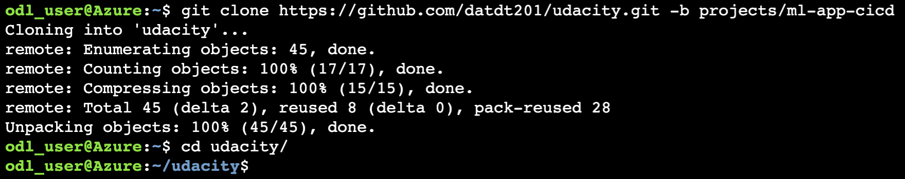
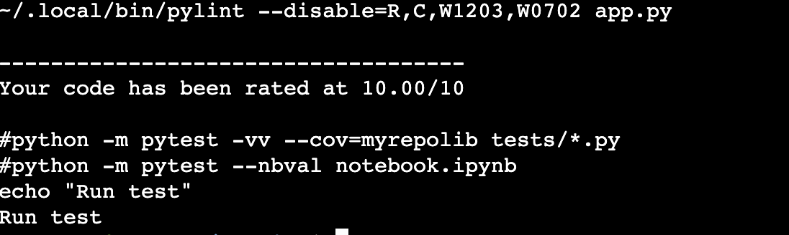
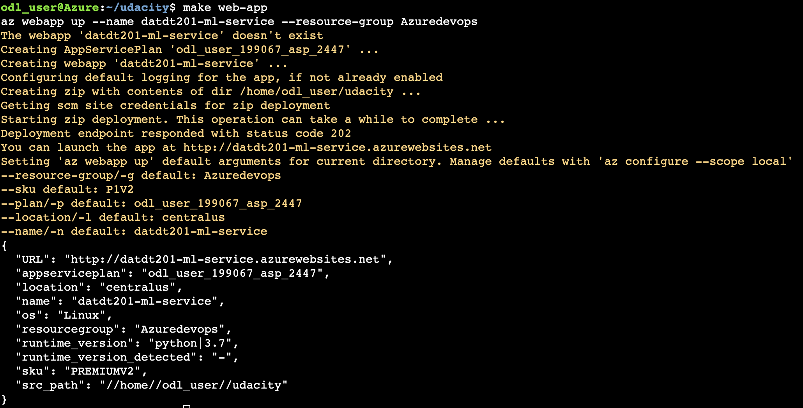
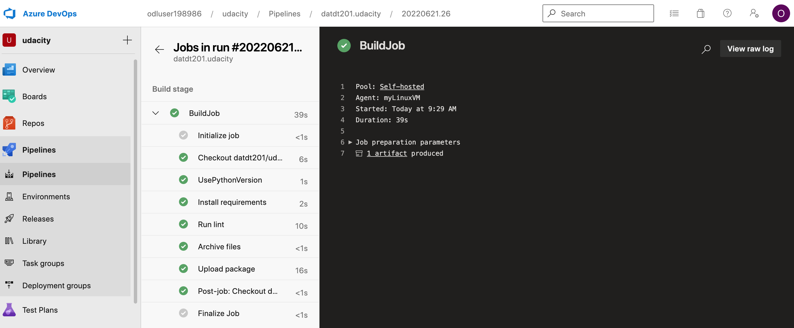
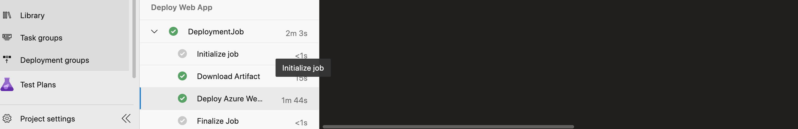
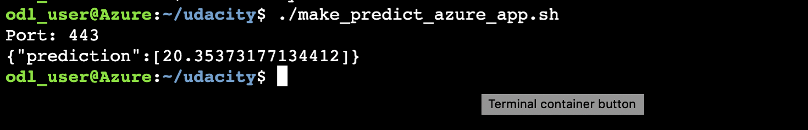
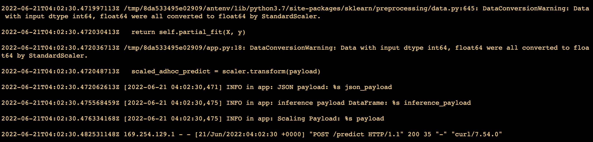

# Overview
This project will demonstrate CICD process for a Python Flask app, using GitHub Actions (CI) and Azure DevOps (CD).

## Project Plan
* Taks management with [Trello board](https://trello.com/invite/b/6Bz6jB9R/3a213e8941dc4cbe1ba5a640b385f6d0/udacity-ml-app)

## Architectural Diagram


## Instructions
### Deploy project with Azure Cloud Shell  
* Clone project into Azure Cloud Shell
```
git clone https://github.com/datdt201/udacity.git -b projects/ml-app-cicd
cd udacity
```


* Install Python virtual environment
```
python3 -m venv .udacity-devops
source .udacity-devops/bin/activate
```
	
* Run lint and tests
```
make all
```


* Deploy project to Azure App Service
```
make web-app
```


### Deploy project with Azure DevOps
* [Configure project in Azure Pipelines](https://docs.microsoft.com/en-us/azure/devops/pipelines/ecosystems/python-webapp?view=azure-devops#create-an-azure-devops-project-and-connect-to-azure).

* Run pipeline to deploy project to App Service



### Verify application
* Prediction from deployed flask app in Azure Cloud Shell.
The output should look similar to this:


* Output of streamed log files from deployed application
```
az webapp log tail --resource-group Azuredevops --name datdt201-ml-service
```


## Enhancements
Following item can be done next to improve the project.
* Define user parameters for Azure DevOps pipelines 
* Split build and deploy stages into 2 pipelines so that we can re-use built artifact to deploy to different environment 

## Demo
https://drive.google.com/drive/folders/1TdfaIawMK1bubP72bB8fFJbIo_u5C8I8?usp=sharing
